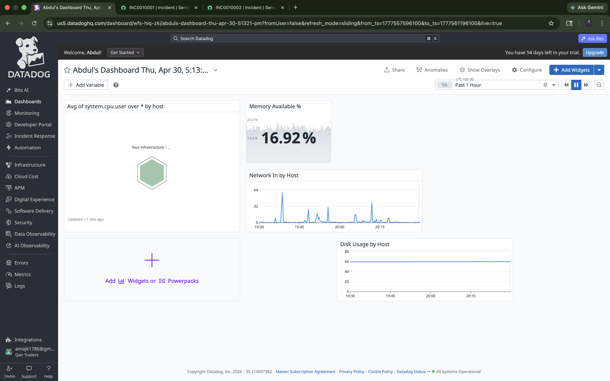

# EOC Infrastructure Monitoring & Alerting Lab

A local infrastructure monitoring lab simulating an **Enterprise Operations Center (EOC)** environment. Built using **Datadog** for monitoring and alerting, integrated with **ServiceNow** for automated incident creation via REST API webhook.

> Built to demonstrate EOC L1 analyst workflows: monitor → detect → alert → auto-create incident → triage → resolve.

---

## Architecture

```
MacBook Air M1 — Monitored Host
        |
        | Datadog Agent v7 (collects system metrics)
        |
        ▼
  Datadog Platform (us5.datadoghq.com)
  |
  ├── EOC Infrastructure Health Dashboard
  |     ├── Host Map (visual health overview)
  |     ├── CPU Usage by Host (timeseries)
  |     ├── Memory Available % (query value)
  |     ├── Disk Usage by Host (timeseries)
  |     └── Network In by Host (timeseries)
  |
  └── Custom EOC Monitors
        ├── High CPU - EOC Monitor
        |     └── Alert fires → Email notification
        |                    → Webhook → ServiceNow REST API
        |                                └── Incident auto-created (INC#)
        ├── Disk Space - EOC Monitor
        └── Host Down - EOC Monitor
```

---

## Stack

| Component | Tool | Purpose |
|---|---|---|
| Monitoring Agent | Datadog Agent v7 (macOS) | Collect host metrics |
| Observability Platform | Datadog Free Trial | Dashboards, monitors, alerting |
| Monitored Host | MacBook Air M1 | Simulated managed endpoint |
| Alert Notification | Datadog Email Alerting | Alert delivery with embedded CPU graph |
| Incident Management | ServiceNow PDI (Free Developer Instance) | Auto-created incidents via REST API |
| Integration Method | Datadog Webhook → ServiceNow `/api/now/table/incident` | No native plugin required |

---

## Dashboard — EOC Infrastructure Health

| Widget | Metric | Type |
|---|---|---|
| Host Map | All hosts | Visual health overview |
| CPU Usage | `avg:system.cpu.user` by host | Timeseries |
| Memory Available | `avg:system.mem.pct_usable` | Query Value |
| Disk Usage | `avg:system.disk.in_use` by host | Timeseries |
| Network In | `avg:system.net.bytes_rcvd` by host | Timeseries |

---

## Monitors & Alert Logic

### Monitor 1 — High CPU - EOC Monitor
```
Query:    avg(last_5m):avg:system.cpu.user{*} by {host} > 40
Warning:  30% | Critical: 40%
Notify:   Email + @webhook-servicenow-incident
```

### Monitor 2 — Disk Space - EOC Monitor
```
Query:    avg(last_5m):avg:system.disk.in_use{*} by {host} > 0.85
Warning:  75% | Critical: 85%
```

### Monitor 3 — Host Down - EOC Monitor
```
Type:     Host Monitor
Trigger:  Host stops reporting > 2 minutes
```

---

## ServiceNow Integration — Datadog Webhook → REST API

Since the native Datadog ITOM/ITSM app is unavailable on ServiceNow PDIs, integration was built manually using a **Datadog Webhook** calling the **ServiceNow Table REST API** directly.

**Webhook URL:**
```
https://dev394792.service-now.com/api/now/table/incident
```

**Payload:**
```json
{
  "short_description": "[$EVENT_TITLE] - Datadog Alert on $HOSTNAME",
  "description": "Monitor: $EVENT_TITLE\nHost: $HOSTNAME\nAlert Status: $ALERT_STATUS\nMetric Value: $ALERT_METRIC\nTime: $DATE\n\nSuggested Actions:\n1. Check for runaway processes\n2. Identify CPU-intensive applications\n3. Escalate to L2 if not resolved in 15 min",
  "urgency": "2",
  "impact": "2",
  "category": "software",
  "caller_id": "admin"
}
```

### Result
Every monitor alert automatically creates a ServiceNow incident with host name, alert status, metric value, timestamp, and 3-step runbook pre-populated.

---

## Alert Lifecycle Demo

```
1. stress --cpu 8 --timeout 300        # Simulate high CPU
2. Datadog monitor fires (OK → Alert)  # Detected within 5 min
3. Email notification sent             # With embedded CPU graph
4. Webhook triggers SNOW REST API      # Auto-creates incident
5. INC0010001 / INC0010002 created    # Full context in description
6. killall stress                      # Resolve the issue
7. Close incident in ServiceNow        # Complete the workflow
```

---

## Screenshots

### EOC Infrastructure Health Dashboard


### Monitor List — All 3 EOC Monitors


### High CPU Monitor in ALERT


### Email Notification with CPU Graph


### ServiceNow Incident List — Auto-Created


### ServiceNow Incident Detail with Runbook

EOF

---

## Runbook

Full L1 SOP for High CPU response: [`docs/high-cpu-response-sop.md`](./docs/high-cpu-response-sop.md)

---

## Key Learnings

- Installed Datadog Agent on macOS and collected live infrastructure metrics
- Built a multi-widget EOC dashboard for single-pane-of-glass visibility
- Created threshold-based monitors with structured runbook alert messages
- Validated full alert lifecycle: detection → email → ServiceNow incident
- Integrated Datadog → ServiceNow via REST API webhook (no native plugin)
- Calibrated thresholds for M1 Mac CPU architecture
- Documented L1 response procedures in a formal SOP

---

## Project Structure

```
eoc-monitoring-lab/
├── README.md
├── docs/
│   └── high-cpu-response-sop.md
└── screenshots/
    ├── dashboard.png
    ├── monitors-list.png
    ├── monitor-alert.png
    ├── email-alert.png
    ├── servicenow-incident-list.png
    └── servicenow-incident-detail.png
```

---

## Author

**Abdul Majid Khan**
CompTIA Security+ | Splunk Core Certified User | ITIL v4 | Fortinet NSE3
Hyderabad, India | [LinkedIn](https://linkedin.com/in/abdulmajidkhan)
